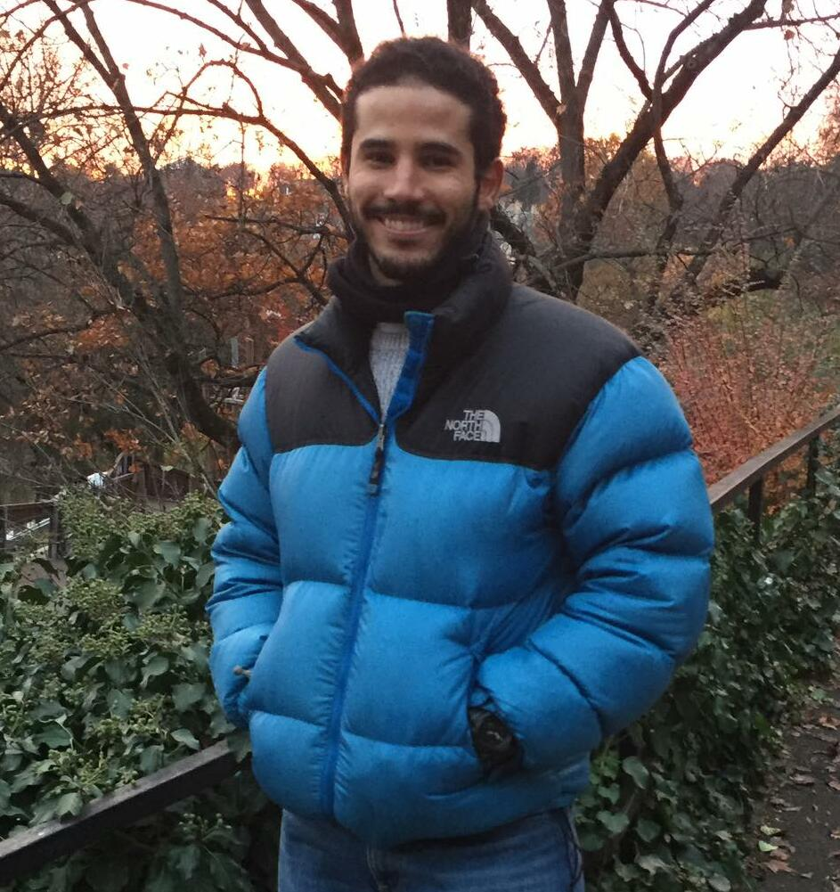

<!---->

### Hi!

<!--  -->

I am a Computer Science student at ELTE, currently an intern in GCS-SRE team at SAP.

<!-- I taught myself how to speak German from scratch amongst other skills as well. -->

<!-- I am currently taking on projects by University and looking forward to getting challenged by something that will expand my boundaries! -->

<!-- ### :chart_with_upwards_trend: My Github stats  -->

<!--  -->

<!--  -->

You can reach me on :

My Email -> :mailbox_with_mail: : alyelalwany@gmail.com

LinkedIn -> 💬 : https://www.linkedin.com/in/aly-elalwany-9a1559197/  

<!--
**AlexHelmutSonntag/AlexHelmutSonntag** is a ✨ _special_ ✨ repository because its `README.md` (this file) appears on your GitHub profile.

Here are some ideas to get you started:

- 🔭 I’m currently working on ...
- 🌱 I’m currently learning ...
- 👯 I’m looking to collaborate on ...
- 🤔 I’m looking for help with ...
- 💬 Ask me about ...
- 📫 How to reach me: ...
- 😄 Pronouns: ...
- ⚡ Fun fact: ...
-->
